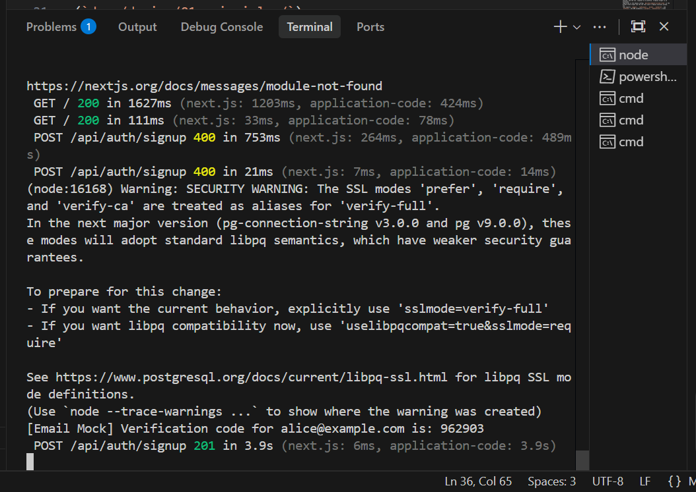
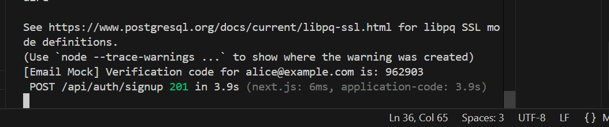
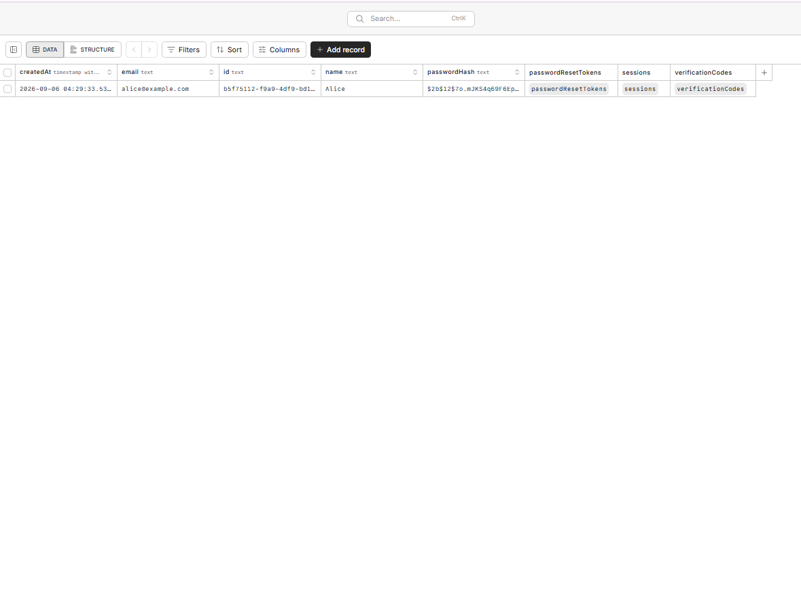
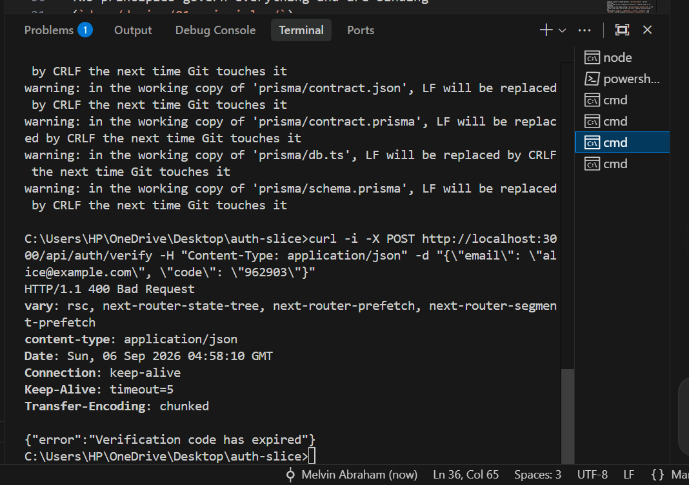
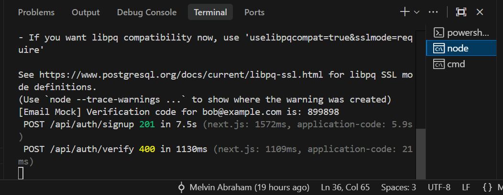
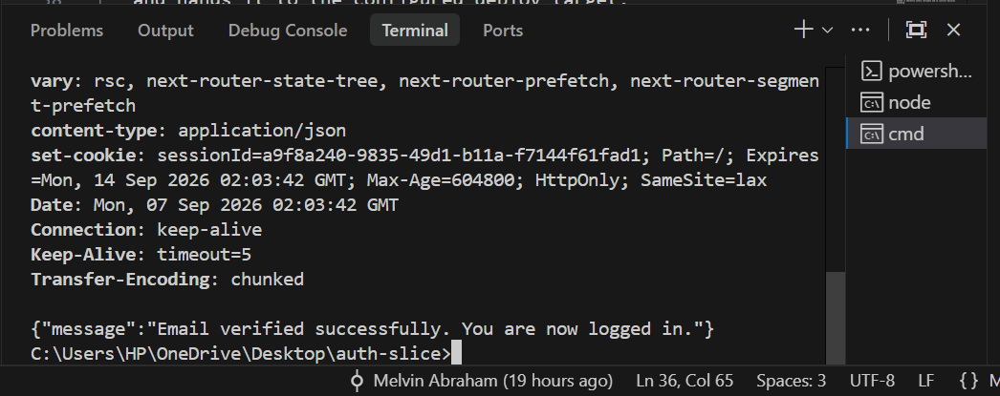
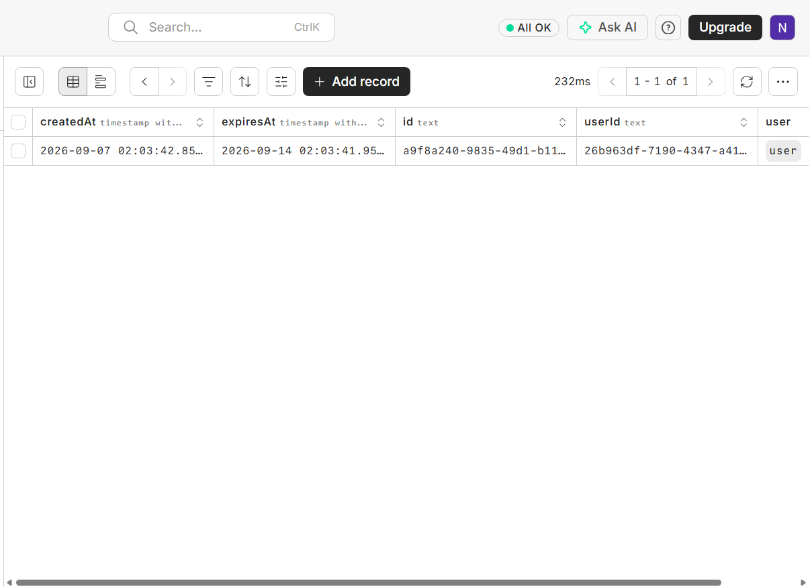
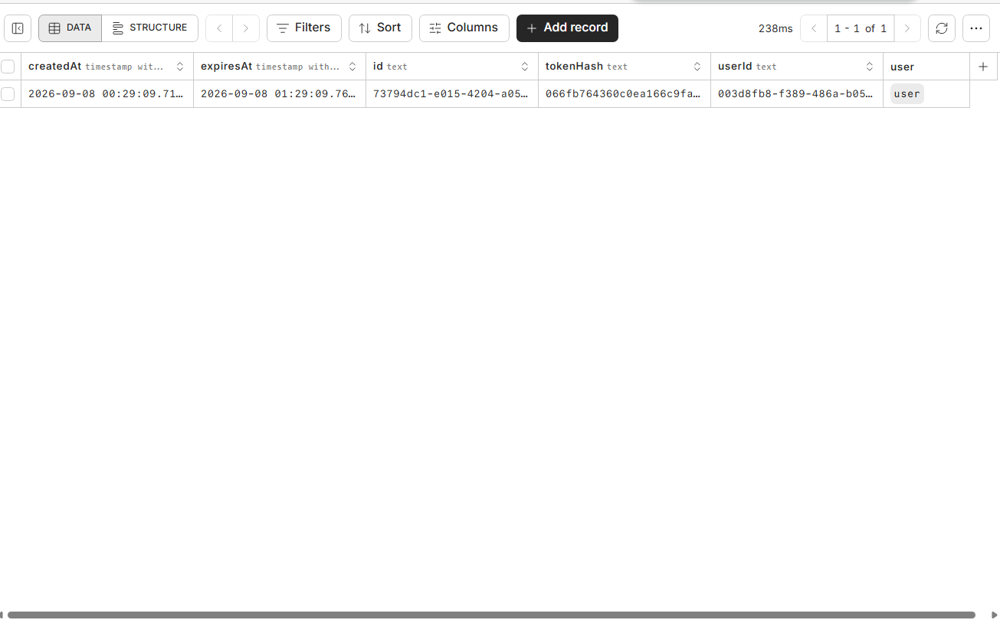
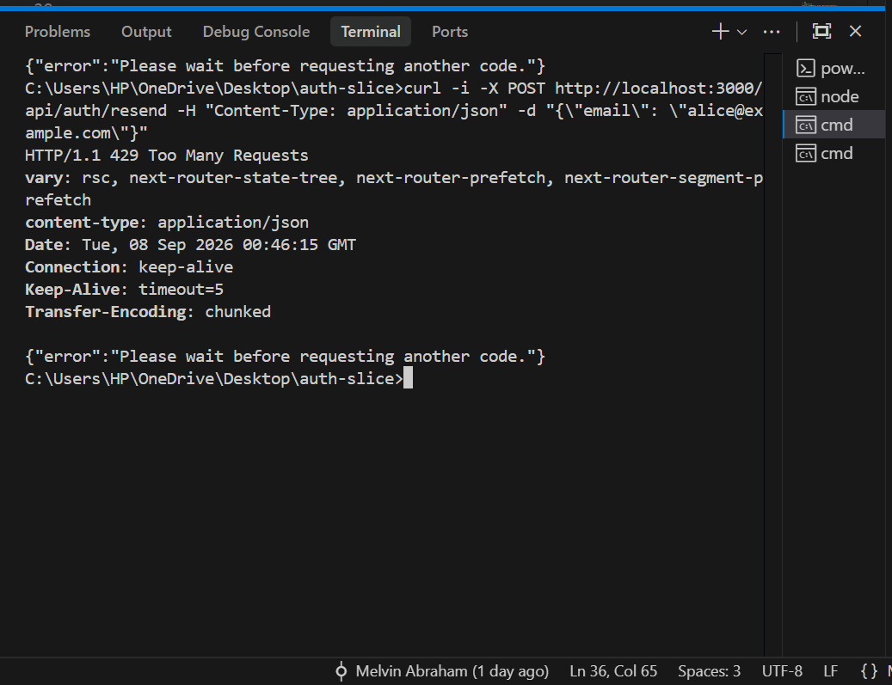
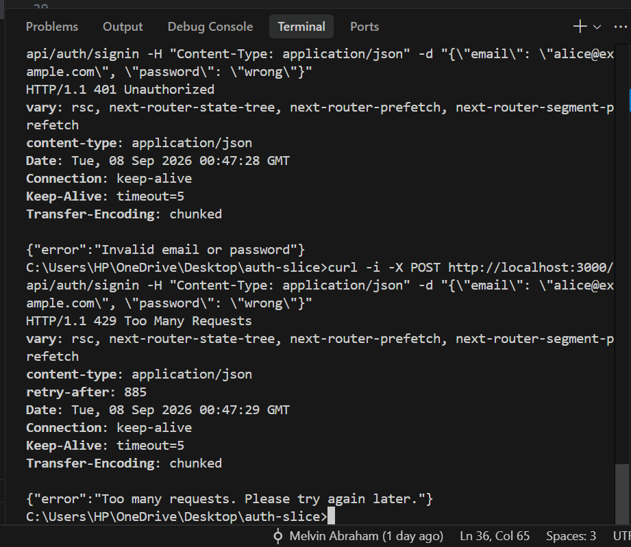

# Auth Slice — Documentation

## 1. What This Is

This is a complete authentication slice for a Next.js app: a user can create an account, verify their email with a 6-digit code, sign in, reset a forgotten password, and reach a signed-in dashboard. Every screen is backed by a real endpoint — signup with idempotent account creation and bcrypt password hashing, email verification with database-enforced code expiry, a resend flow with a server-side cooldown, signin with session cookies, and a full forgot/reset password flow using single-use hashed tokens. Every authentication route is rate limited, and the dashboard is a protected route that redirects unauthenticated visitors to sign in.

What's deliberately not here: no profile editing, no settings, no social sign-in, no two-factor authentication, and no dashboard beyond a single line showing the signed-in user's name and a sign-out button. The brief scoped this as a single slice, not an application, so anything outside the six required screens and their backing logic was left out on purpose, keeping the authentication itself as the only thing in the repository.

## 2. How To Run It

<!--
Numbered steps, fresh clone to running instance. A reviewer who cannot run this
in under ten minutes assumes it does not run.
-->

**Prerequisites**

-

**Steps**

1.

**Environment variables**

| Name | Where it comes from |
|---|---|
| | |

<!-- .env.example must exist in the repo with commented placeholders. -->

**Database setup**

```bash

```

**Start it**

```bash

```

**It appears at:** `http://localhost:____`

## 3. The Flow, Step By Step

<!--
Narrative, not a list of endpoints. For each step, three things:
  - what the user does
  - what the frontend sends
  - what the server does with it
Name the actual route or file for each step.

Test: could a reader finish this section able to predict where in the codebase
any given behaviour lives?
-->

### Step 1 — [what the user does]

**User:**
**Frontend sends:**
**Server does:**
**Lives in:** `path/to/file`

<!-- repeat -->

## 4. The Data Model

<!-- Every table the slice uses. -->

### `table_name`

One line on what it holds:

| Column | Type | Constraint | Decision |
|---|---|---|---|
| | | | |

<!--
The "Decision" column is only for columns that carry one. Why that type. Why
that constraint. Why nullable or not nullable.
-->

### Which constraints make an invalid state impossible?

<!--
Answer this explicitly. I write this part, not the agent.

For each constraint, name what it prevents. A unique constraint, a check
constraint, or a foreign key is not decoration — it is the last line of defence
when the application code has a bug. Naming what each one prevents shows I chose
it rather than accepted it.
-->

## 5. The Concepts

<!--
THE HEART OF THE DOCUMENT. THE MOST HEAVILY GRADED SECTION.

Every concept from the assessment's list gets its own subheading and all four
questions, in this order. No skipping the fourth — it is the question that
separates people who made decisions from people who accepted defaults.

Source material: docs/decisions.md.
Depth expected: see the Password Hashing worked example in the brief.

I WRITE THIS SECTION. Not the agent.
-->

### [Concept name]

**What it is.**
<!-- 2–3 sentences, my own words, as though the reader has never heard the term.
Not a dictionary definition. -->

**Why it is needed.**
<!-- What goes wrong without it. Concrete. Name the failure. -->

**How I implemented it.**
<!-- What I actually did, with the file or function named. Code excerpt only
where it helps, ten lines maximum. -->

**What I chose against, and why.**
<!-- The alternative I did not take, and the reason. -->

<!-- repeat for every concept on the list -->

## 6. What Went Wrong

<!--
Minimum three real problems. Do not sanitise this.
I WRITE THIS SECTION. An agent cannot know what I saw on my screen at 2am.
-->

### Problem 1 — [short name]

**The symptom.**

**The investigation.**

**The cause.**

**The fix.**

### Problem 2 — [short name]

### Problem 3 — [short name]

## 7. What This Slice Does Not Handle

**What breaks at scale**

- Rate limiting is enforced through a database table using a fixed-window strategy, which is simple and correct for a single-instance app but would need to move to something like Redis if this ran across multiple server instances, since a fixed window in Postgres doesn't coordinate across instances the way an in-memory or distributed store would. Sessions are similarly database-backed, which means every authenticated request costs a database read — fine at this scale, but a real bottleneck under heavy traffic.

**What I would need before real users touched it**

- Actual email delivery. Right now, verification codes and reset links are logged to the server console rather than sent through a real email provider — this was a deliberate choice to keep the slice focused on the authentication logic itself rather than third-party integration, but it would need to change before anyone but me could use this.

**Left out because it was outside the brief**

- Social sign-in, two-factor authentication, profile editing, and any dashboard functionality beyond the name and sign-out button. These were explicitly excluded by the assessment brief, not left out due to time.

**Left out because I ran out of time**

- Everything in scope was completed and nothing was cut for time.

## 8. If I Built This Again

<!--
ONE paragraph. ONE thing. Not a list. Chosen deliberately.
-->

---

## Evidence


### Signup — server-side validation rejects bad input



**What this shows:** Hitting the signup endpoint directly with curl, bypassing
the browser entirely, with a malformed email and a short password. The server
returns 400 with Zod validation errors for both fields, proving validation is
enforced server-side and not just in the UI.

### Signup — successful account creation



**What this shows:** A valid signup request returns 201, and the server log
shows the verification code generated for that user, confirming the flow
proceeds correctly from account creation into email verification.

### Password hash stored, not plaintext



**What this shows:** The `passwordHash` column contains a bcrypt hash
(`$2b$12$...`), confirming the plaintext password is never stored.

### Verification code expiry enforced server-side



**What this shows:** Submitting a verification code after its 15-minute TTL has
passed returns 400 with "Verification code has expired," proving expiry is
checked against the database on every submission, not just shown as a UI
countdown.

### Verification input validated by the shared schema



**What this shows:** Submitting a code that isn't exactly 6 digits is rejected
by the same shared Zod schema used across the app, confirming validation isn't
duplicated or endpoint-specific.

### Successful verification sets a secure session cookie



**What this shows:** A valid code returns 200 with a `Set-Cookie` header
containing `HttpOnly`, `SameSite=lax`, and the configured `Max-Age`, matching
the cookie flags decided in `docs/decisions.md`.

### Session row created on successful verification



**What this shows:** The `session` table contains a row matching the session ID
issued in the cookie above, confirming the session is genuinely persisted in
the database, not just issued client-side.

### Password reset token is hashed before storage



**What this shows:** The `tokenHash` column holds a SHA-256 hash that is
completely different from the raw token sent in the reset email link,
confirming the raw token is never stored — only a hash of it.

### Rate limit triggers on the resend endpoint



**What this shows:** After 3 resend attempts, the 4th request returns 429 with
"Please wait before requesting another code," confirming the resend cooldown is
enforced server-side, not just disabled in the UI.

### Rate limit triggers on the signin endpoint, with retry indication



**What this shows:** Repeated failed signin attempts first return 401
(invalid credentials, endpoint working correctly), then after 5 attempts
return 429 with a `retry-after: 885` header, giving the client an exact time
to wait before retrying — satisfying the Excellent-band requirement for a
retry indication.
<!--
The brief's "Prove it works" items. Screenshots live in /evidence/ and are
referenced with relative paths so they render on GitHub. 
-->

### [Evidence item 1]


**What this shows:**